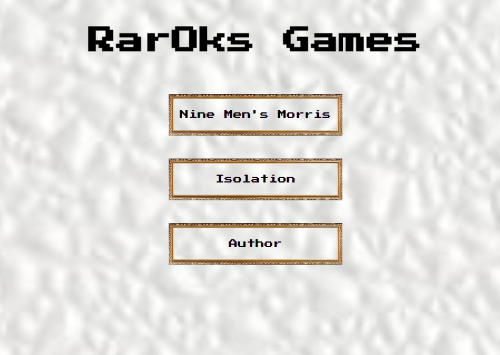
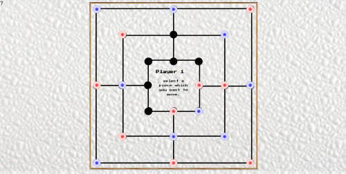
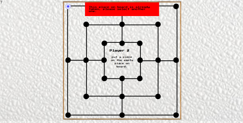
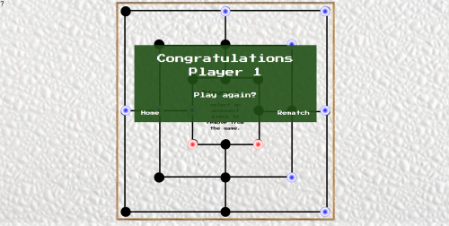
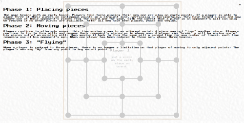
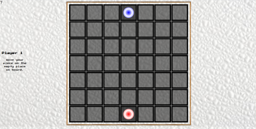
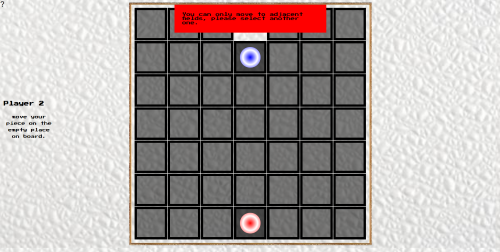
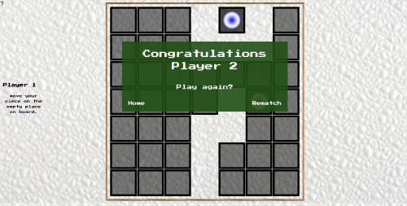
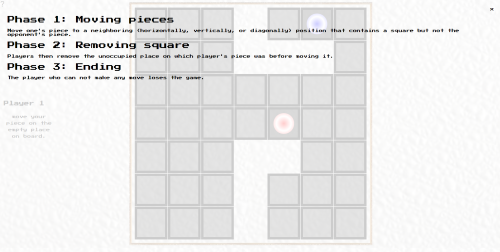

# RarOks Games

*My final thesis, games Nine Men's Morris and Isolation made with JavaScript.*

## Website Desing

### *Home page*

Home page with links to games.

### *Nine Men's Morris Start page*

Empty game board for starting the game.

### *Nine Men's Morris Full Table page*

Status of the board, after both players have placed their pieces on board.

### *Nine Men's Morris Error page*

Error message when player plays something he is not supposed to.

### *Nine Men's Morris Victory page*

Victory notification after the game ends.

### *Nine Men's Morris Rules page*

Rules for Nine Men's Morris.

### *Isolation Starting page*

Starting board for the game Isolation.

### *Isolation Error page*

Error notification when player plays something he is not supposed to.

### *Isolation Victory page*

Victory notification when the game ends.

### *Isolation Rules page*

Rules for Isolation.